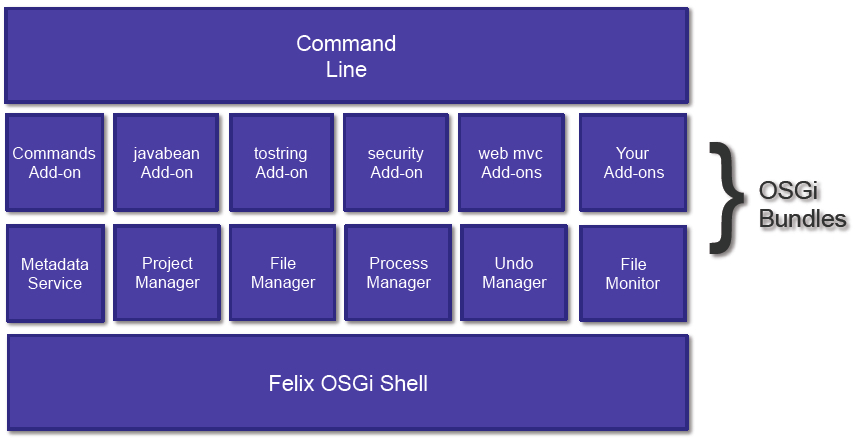

!SLIDE

# What are Roo Add-ons?

* Add-ons are OSGi bundles
* To understand this we have to detour
* What is OSGi in the context of Roo?

!SLIDE

# OSGi in 5 minutes (really)

* OSGi - dynamic module loading system
  * `Bundle` = Jar w/instructions (`META-INF/MANIFEST.MF`  )
  * `OSGi Container` - a runtime platform (Apache Felix)
  * `OSGi Shell` - command line exposed by container
* Roo uses OSGi to mount and expose commands
* Roo does *not* use OSGi in production

!SLIDE full-screen

# OSGi's dreaded `META-INF/MANIFEST.MF`

!SLIDE full-screen

# Roo and OSGi bundles

!SIDE center

# Roo add-on project structure
