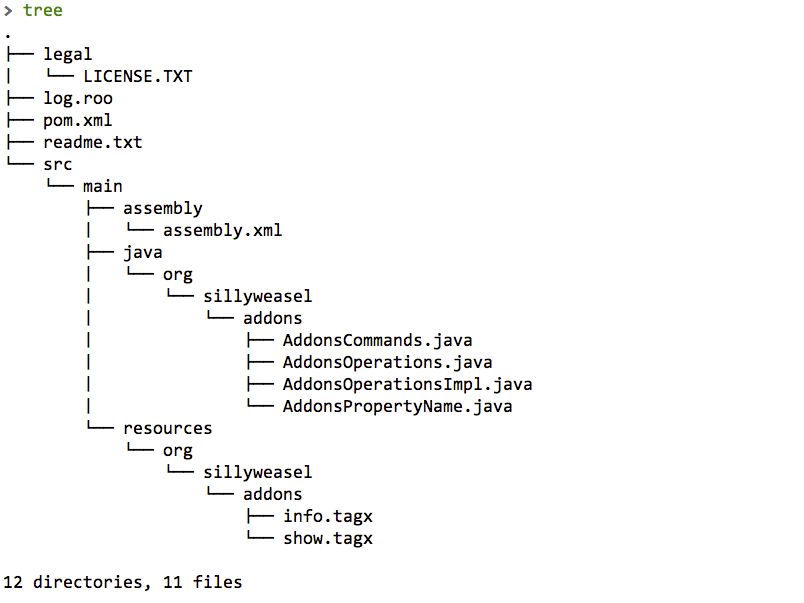

!SLIDE center

# Simple add-ons - jQuery / jQuery UI

!SLIDE bullets

# jQuery add-on features

* Installs the jQuery Javascript library
* Installs jQueryUI and associated images and theme files

* Exposed by two commands
  * `jquery setup` - sets up jQuery
  * `jqueryui setup` - installs jQuery UI
  
!SLIDE bullets

# Creating the add-on

    @@@java
    $ mkdir jquery-addon
    $ cd jquery-addon
    $ roo
    ...
    roo> addon simple create 
        --projectName jqueryaddon
        --topLevelPackage org.sillyweasel.addons

* Let's review the files Roo created...
        
!SLIDE full-screen

# Files created by the _simple_ add-on

!SLIDE center

# Let's do something simple...

!SLIDE

# Installing a simple command

* Expose a dummy `jquery setup` command
* Echo a success message to the Roo shell

!SLIDE 

# Create a _command_ OSGi Component

    @@@java
    @Component
    @Service
    public class JqueryaddonCommands implements CommandMarker {
       private Logger log =
         Logger.getLogger(getClass().getName());
    
       @CliCommand(value = "jquery setup", help = "Setup jQuery")
       public void sayHello() {
          log.severe("jQuery installed.");
       }
    }

!SLIDE 

# Run the example

     @@@java
     roo> quit
   
     $ mvn clean package
   
     Build successful.
   
     $ roo
   
     roo> osgi start --url (full path to jar in ./target)   
     roo> jquery setup
   
     jQuery installed.

!SLIDE center

# Refactor - delegate command to component

!SLIDE

# Our `JqueryaddonOperations` interface

     @@@java
     package org.sillyweasel.jqueryaddon;
     public interface JqueryaddonOperations {
        void setup();
     }
   
* Interface driven components, just like Spring

!SLIDE 

# The implementation class
.notes `@Component` and `@Service` expose this bean, `@Reference' injects another bean_

    @@@java
    package org.sillyweasel.addons.jquery;
    ...
    @Component
    @Service
    public class JqueryOperationsImpl
       extends AbstractOperations 
       implements JqueryOperations {
       
       @Reference private ProjectOperations projectOperations;
       
       public void setup() {
          ...
       }
       
    }

!SLIDE

# The `setup()` method in detail

    @@@java
    public void setup() {
      
       String pathIdentifier = 
          pathResolver.getFocusedIdentifier(
            Path.SRC_MAIN_WEBAPP, "js");
            
       copyDirectoryContents("jquery-1.8.1.min.js",
          pathIdentifier, true);
          
    }

* `copyDirectoryContents` is a method of `AbstractOperations`
* We manually changed our bean to extend this class

!SLIDE

# Stage the asset(s)

    
    src/main/resources *
              └── org
                  └── sillyweasel
                     └── addons
                          └── jquery
                            └── jquery-1.8.1.min.js

_* Made available in JAR for copying into project_

!SLIDE bullets

# OSGi's SCR API makes delegation easy

* Expose components via `@Component` and `@Service`
  * `@Component` provides lifecycle
  * `@Service` provides component for injection
* Inject delegate with `@Reference`
* Sounds vaguely familiar...

!SLIDE

# Injection and calling `JqueryaddonOperations.setup()`

    @@@java
    // replace JqueryaddonCommands with:
    
    @Component
    @Service
    public class JqueryaddonCommands implements CommandMarker {
      
       @Reference private JqueryaddonOperations addonOperations;
       
       @CliCommand(value = "jquery setup", help = "Setup jQuery")
       public void setup() {         
          // call delegate
          addonOperations.setup();          
       }
    }

!SLIDE bullets

# What else can you do with Roo Components/Services

* Inject services from other bundles...
  * More complex with non--core-Roo components
  * Must wrestle with dependencies and/or MANIFEST entries
  * Not covered here - we will inject standard Roo services
    
