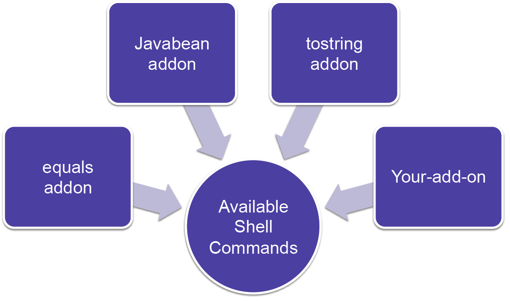
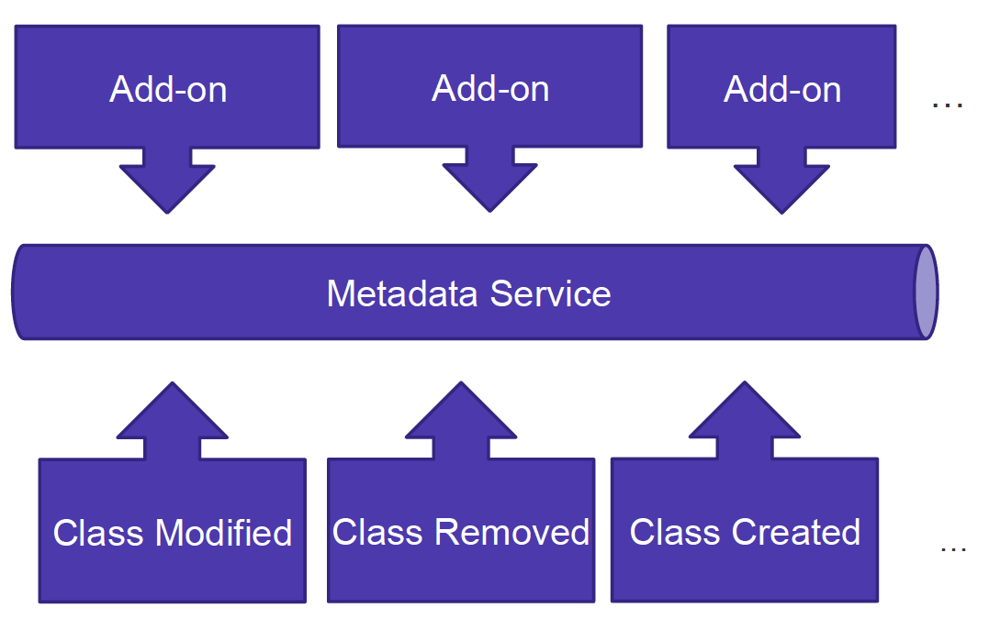

!SLIDE bullets incremental

# What are Roo Add-Ons?

* Components that can add commands and behavior to a running Roo Shell
  * OSGi bundle (JAR) projects
  * Created in Roo itself
  * Built using Maven

!SLIDE bullets

# Can be installed in a variety of ways

* Locally via JAR
  * `roo> osgi start --url` _`path`_
* Object Bundle Repository
  * `osgi obr` command set
* Roo public add-on registry
  * `addon` command set
  
!SLIDE bullets

# Add-on Project Types

* Four types of add-ons available
  * Simple
  * Advanced
  * i18n
  * wrapper
* We'll focus on the simple and advanced ones

!SLIDE bullets

# Simple add-ons

    @@@java
    roo> addon create simple --projectName simpleaddon
         --topLevelPackage org.foo.bar

* Modifies files in your project structure
* Example add-on: jQuery add-on
* Features used: modifies mvc tags and adds jQuery library

!SLIDE bullets

# Advanced add-ons

    @@@java
    roo> addon create advanced --projectName advancedaddon
         --topLevelPakage org.foo.bar
         
* Adds maven manipulation, base class for re-use of framework
* Example: CoffeeScript add-on
* Features used: transactional file copy, maven build configuration changes

!SLIDE

# i18n add-ons

* Creates a new language bundle
* The language bundle can be installed
* Adds support for additional languages
* Example: support the Norwegian language

!SLIDE

# wrapper add-ons

* Builds an OSGi-compliant JAR
* Wraps an existing Maven JAR's contents
* Allows the JAR to be loaded into the Roo shell at runtime
* This may be required for JDBC drivers, other features needed by shell add-ons
* Example: Wrapper around JDBC Driver for DBRE

!SLIDE

# Add-on API key features

* Injecting Shell commands
* Providing Events to other Shell add-ons
* Subscribe to and publish to the Meta-Data Service
* Write, edit, and manipulate ITDs and Java classes

!SLIDE

# What are ITDs?
* Inter-Type Declarations
  * AspectJ-generated class fragments
  * Woven into existing classes

* Separates features from boilerplate
* 100% compile-time - no runtime component

!SLIDE

# Sample ITD

    @@@java
    privileged aspect Course_Roo_ToString {

        public String Course.toString() {
            return ReflectionToStringBuilder
               .toString(this, 
                         ToStringStyle.SHORT_PREFIX_STYLE);
        }
    }

* Generated by shell via `@RooToString` on entity
* Generation done via ToString add-on

!SLIDE 

# Injecting Commands

!SLIDE

# Roo Metadata Service

